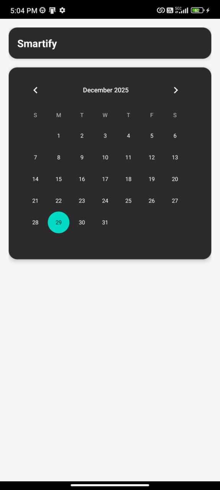
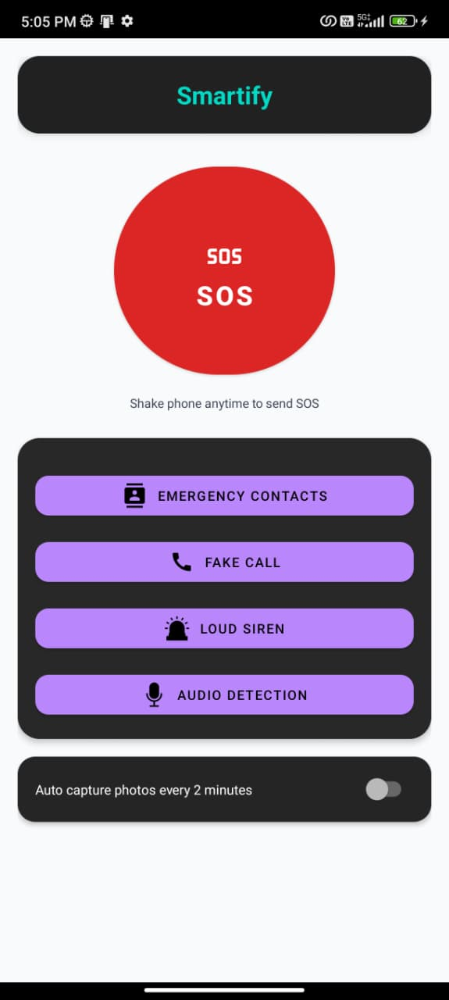

                                               Smartify – Android Personal Safety App

#  Smartify 

**Smartify** is a Kotlin-based Android safety application designed to assist women and children during emergency situations. The app combines intelligent triggers, background-safe execution, and stealth UI techniques to provide quick, reliable, and covert emergency assistance.

---

## ✨ Features

### 📆 Calendar Lock (Stealth Dashboard)
To ensure privacy and safety from potential aggressors, the app launches with a fully functional **Calendar** interface. 
* The actual safety dashboard and settings are hidden.
* The dashboard is revealed **only** when the user performs a specific interaction (custom date).

### 🗣️ Safe Word Detection (Background Listening)
Continuously listens for predefined safe words (e.g., *“help”*, *“emergency”*, *“save me”*) in the background. Once a safe word is detected:
1. **Sends SOS Messages**: Sends an SMS with the user's real-time GPS location coordinates to pre-configured emergency contacts.
2. **Triggers Emergency UI**: Displays a full-screen emergency notification.
3. **Quick Call**: Enables a one-tap call to emergency services (**112**).

### 📞 Fake Call Simulation
Simulates a highly realistic incoming call screen (with customizable caller name, number, and ringtone) to help users politely and safely escape uncomfortable or potentially unsafe social situations.

### 📸 Automatic Photo Capture
When enabled, the app uses the device camera to periodically capture photos in the background, providing crucial visual evidence for safety and legal protection.

### 🗺️ Real-time Location & Map Integration
Integrates Google Maps to display the user's current location and nearby help centers. Accurate coordinates are instantly fetched and appended to SOS messages.

---

## 📸 Screenshots

| 📆 Calendar Lock Screen | 🏠 Home Dashboard | 📞 Fake Call Simulator |
| :---: | :---: | :---: |
|  |  |  |

---

## 🧠 Technical Highlights & Stack

Smartify is built using modern Android development practices, ensuring high performance, battery efficiency, and compliance with the latest Android background execution limits.

* **Language**: [Kotlin](https://kotlinlang.org/)
* **UI Framework**: [Jetpack Compose](https://developer.android.com/jetpack/compose) (Material 3 Components)
* **Architecture**: Clean Architecture with MVVM (Model-View-ViewModel) pattern
* **Dependency Injection**: [Hilt (Dagger)](https://developer.android.com/training/dependency-injection/hilt-android)
* **Local Database**: [Room Database](https://developer.android.com/training/data-storage/room) (for contacts and logs)
* **Data Storage**: [DataStore Preferences](https://developer.android.com/topic/libraries/architecture/datastore) (for user settings)
* **Background Processing**:
  * **Foreground Services** for continuous safe-word listening and location tracking
  * **WorkManager** for scheduled or deferred background tasks
* **Camera Integration**: [CameraX API](https://developer.android.com/training/camerax) for background evidence capture
* **Location & Maps**: Google Play Services Location & [Maps Compose](https://github.com/googlemaps/android-maps-compose)
* **Backend Services**: [Firebase Suite](https://firebase.google.com/) (Auth, Firestore, Cloud Messaging, Storage, Crashlytics, Analytics)

---

## 👨‍💻 Developer

**Shikhar Agarwal**  
🎓 B.Tech in Computer Science & Artificial Intelligence (CSAI)  
🏛️ Indian Institute of Information Technology (IIIT), Lucknow  

